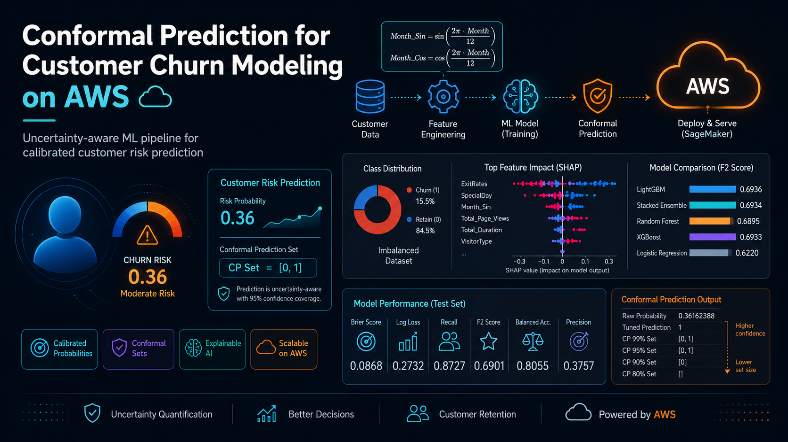

# Conformal Prediction for Customer Churn Modeling on AWS

## Overview

This project develops an uncertainty-aware machine learning pipeline for customer churn/purchase-risk modeling using online shopping session data. The main objective is to support marketing decisions by estimating whether a customer is likely to convert and whether the model is confident enough to act on that prediction.

Instead of relying only on raw probability scores, the project applies **conformal prediction** to quantify uncertainty and produce prediction sets such as `[1]`, `[0]`, or `[0, 1]`. This makes the model more useful in real-world decision-making, where uncertain customers may require different marketing actions than clearly high- or low-intent customers.

## Business Problem

In an e-commerce setting, marketing teams often need to decide whether a customer should receive a discount coupon or targeted campaign. A standard binary classifier can output a probability or a hard prediction, but it does not clearly communicate uncertainty.

This project addresses the following question:

> Can we build a calibrated machine learning pipeline that predicts customer purchase/churn risk while also identifying uncertain cases through conformal prediction?

## Dataset

The project uses the **Online Shoppers Purchasing Dataset** from Kaggle, containing simulated e-commerce session-level behavior.

Each row represents a customer session and includes behavioral, technical, and contextual features such as:

- Administrative, informational, and product-related page visits
- Time spent on different page categories
- Exit rates and bounce rates
- Special shopping day proximity
- Month of the session
- Browser, operating system, region, and traffic type
- Visitor type
- Weekend indicator
- Revenue as the binary target variable

The dataset is highly imbalanced, which is expected because most website sessions do not result in a purchase.

## Methodology

### 1. Data Preprocessing

The preprocessing stage includes:

- Encoding boolean and categorical variables
- Checking missing values
- Handling class imbalance through stratified splitting
- Removing leakage-prone or redundant variables
- Applying robust scaling to numerical features
- Applying target encoding to high-cardinality categorical variables

The preprocessing steps are designed to avoid data leakage by learning transformation statistics only from the training data.

### 2. Feature Engineering

Several behavioral features are engineered to better capture customer intent:

- Average time spent per product page
- Average time spent per administrative page
- Product focus ratio
- Total page views
- Cyclical month features using sine and cosine transformations

The cyclical transformation allows the model to understand seasonal shopping behavior more naturally.

### 3. Leakage Control

Some variables are removed to prevent leakage or redundancy:

- `PageValues` is dropped because it is strongly tied to the final transaction outcome.
- `BounceRates` is removed due to its very high correlation with `ExitRates`.
- Raw duration and page-count variables are removed after creating stronger engineered features.

### 4. Train / Calibration / Test Split

The dataset is split into three parts:

- Training set
- Calibration set
- Test set

The calibration set is especially important for conformal prediction because it allows the model to construct statistically meaningful prediction sets.

## Models

The following models are trained and compared:

- Logistic Regression baseline
- Random Forest
- XGBoost
- LightGBM
- Stacked Ensemble

Hyperparameter tuning is performed using **Optuna** with a Tree-structured Parzen Estimator sampler. The main optimization metric is the **Brier Score**, because this project prioritizes calibrated and reliable probability estimates rather than only ranking performance.

## Why Brier Score?

For this project, probability quality matters.

A model that predicts an 80% purchase probability should ideally be correct around 80% of the time for similar customers. The Brier Score helps evaluate and optimize this kind of probability calibration.

This is especially important because conformal prediction depends on meaningful probability outputs and uncertainty estimation.

## Explainability

Model interpretation is performed using SHAP-based feature importance analysis.

The most influential features include:

- Exit rates
- Special day proximity
- Month-based seasonality
- Total page views
- Total session duration
- Visitor type

The SHAP results show that customer engagement, session behavior, and seasonal effects are important predictors of purchase intent.

## Conformal Prediction

A key part of this project is the use of conformal prediction.

Instead of only producing a hard class prediction, the model can return prediction sets:

| Prediction Set | Interpretation |
|---|---|
| `[1]` | Confident purchase / high-risk prediction |
| `[0]` | Confident non-purchase prediction |
| `[0, 1]` | Uncertain case |
| `[]` | Very unstable prediction under the selected confidence level |

This helps distinguish between customers who are clearly likely to purchase and customers who are uncertain or persuadable.

## Model Performance

The best-performing model based on out-of-fold F2 Score is LightGBM.

| Model | OOF F2 Score |
|---|---:|
| Logistic Regression | 0.6220 |
| LightGBM | 0.6936 |
| XGBoost | 0.6933 |
| Random Forest | 0.6895 |
| Stacked Ensemble | 0.6934 |

## Final Test Set Results

The final end-to-end pipeline achieves the following test performance:

| Metric | Value |
|---|---:|
| Log Loss | 0.2732 |
| Brier Score | 0.0868 |
| Balanced Accuracy | 0.8055 |
| F2 Score | 0.6901 |
| Recall | 0.8727 |
| Precision | 0.3757 |

The high recall shows that the model successfully captures a large share of potential buyers. The lower precision reflects the business trade-off: the model accepts more false positives in order to avoid missing customers who may convert with the right marketing action.

## AWS Usage

AWS is used as part of the scalable computing environment for the project. In particular, AWS EMR is used to leverage CPU resources for large-scale data processing and experimentation.

## Key Takeaways

- LightGBM provides the strongest overall F2 performance.
- Brier Score optimization improves the reliability of probability estimates.
- SHAP analysis shows that exit behavior, seasonality, and engagement are key drivers.
- Conformal prediction adds an uncertainty layer beyond standard binary classification.
- The final pipeline can support marketing decisions by identifying both confident and uncertain customer cases.
